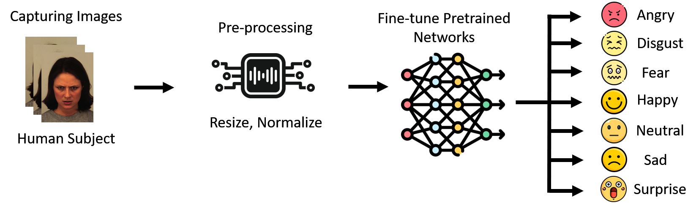

# Facial Expression Recognition using the CK+ dataset

## Dataset Link: https://www.kaggle.com/datasets/shawon10/ckplus

## Kaggle Notebook: https://www.kaggle.com/code/shasan07/fer-tf-keras

The images were transformed and resized using tf, then we fed them to the **pretrained ResNet101 model for fine-Tuning**. (Several other popular pre-trained models are also listed along with it).

A **learning rate of 1e-4** was used, along with **batch size of 8**, and the training was conducted for **50 epochs**.
**The best validation accuracy achieved by our model is 99.49%**.

Training Summary:

    Epoch 1/50
    99/99 ━━━━━━━━━━━━━━━━━━━━ 200s 660ms/step - accuracy: 0.6238 - loss: 1.9454 - val_accuracy: 0.5153 - val_loss: 5.1240
    Epoch 2/50
    99/99 ━━━━━━━━━━━━━━━━━━━━ 23s 231ms/step - accuracy: 0.9347 - loss: 0.2908 - val_accuracy: 0.7092 - val_loss: 1.4095
    Epoch 3/50
    99/99 ━━━━━━━━━━━━━━━━━━━━ 23s 229ms/step - accuracy: 0.9649 - loss: 0.1546 - val_accuracy: 0.8827 - val_loss: 0.6826
    Epoch 4/50
    99/99 ━━━━━━━━━━━━━━━━━━━━ 13s 133ms/step - accuracy: 0.9653 - loss: 0.2219 - val_accuracy: 0.7347 - val_loss: 0.9526
    Epoch 5/50
    99/99 ━━━━━━━━━━━━━━━━━━━━ 13s 133ms/step - accuracy: 0.9696 - loss: 0.2238 - val_accuracy: 0.3010 - val_loss: 85.1607
    Epoch 6/50
    99/99 ━━━━━━━━━━━━━━━━━━━━ 13s 134ms/step - accuracy: 0.8904 - loss: 0.9186 - val_accuracy: 0.8367 - val_loss: 0.8780
    Epoch 7/50
    99/99 ━━━━━━━━━━━━━━━━━━━━ 23s 233ms/step - accuracy: 0.9751 - loss: 0.1389 - val_accuracy: 0.9898 - val_loss: 0.0400
    Epoch 8/50
    99/99 ━━━━━━━━━━━━━━━━━━━━ 13s 133ms/step - accuracy: 0.9860 - loss: 0.0552 - val_accuracy: 0.9694 - val_loss: 0.1258
    Epoch 9/50
    99/99 ━━━━━━━━━━━━━━━━━━━━ 13s 133ms/step - accuracy: 0.9899 - loss: 0.0893 - val_accuracy: 0.9898 - val_loss: 0.0150
    Epoch 10/50
    99/99 ━━━━━━━━━━━━━━━━━━━━ 13s 134ms/step - accuracy: 0.9938 - loss: 0.0977 - val_accuracy: 0.9745 - val_loss: 0.1029
    Epoch 11/50
    99/99 ━━━━━━━━━━━━━━━━━━━━ 13s 133ms/step - accuracy: 0.9665 - loss: 0.1010 - val_accuracy: 0.9541 - val_loss: 0.1482
    Epoch 12/50
    99/99 ━━━━━━━━━━━━━━━━━━━━ 13s 133ms/step - accuracy: 0.9005 - loss: 0.8510 - val_accuracy: 0.7041 - val_loss: 1.6365
    Epoch 13/50
    99/99 ━━━━━━━━━━━━━━━━━━━━ 13s 133ms/step - accuracy: 0.9706 - loss: 0.1635 - val_accuracy: 0.7143 - val_loss: 1.2937
    Epoch 14/50
    99/99 ━━━━━━━━━━━━━━━━━━━━ 23s 233ms/step - accuracy: 0.9956 - loss: 0.0184 - val_accuracy: 0.9949 - val_loss: 0.0115
    Epoch 15/50
    99/99 ━━━━━━━━━━━━━━━━━━━━ 13s 134ms/step - accuracy: 1.0000 - loss: 7.5090e-04 - val_accuracy: 0.9949 - val_loss: 0.0155
    Epoch 16/50
    99/99 ━━━━━━━━━━━━━━━━━━━━ 13s 133ms/step - accuracy: 1.0000 - loss: 3.1979e-04 - val_accuracy: 0.9949 - val_loss: 0.0184
    Epoch 17/50
    99/99 ━━━━━━━━━━━━━━━━━━━━ 13s 132ms/step - accuracy: 1.0000 - loss: 1.1756e-04 - val_accuracy: 0.9898 - val_loss: 0.0195
    Epoch 18/50
    99/99 ━━━━━━━━━━━━━━━━━━━━ 13s 128ms/step - accuracy: 1.0000 - loss: 6.6640e-05 - val_accuracy: 0.9949 - val_loss: 0.0193
    Epoch 19/50
    99/99 ━━━━━━━━━━━━━━━━━━━━ 13s 129ms/step - accuracy: 1.0000 - loss: 3.6755e-05 - val_accuracy: 0.9949 - val_loss: 0.0196
    Epoch 20/50
    99/99 ━━━━━━━━━━━━━━━━━━━━ 13s 131ms/step - accuracy: 1.0000 - loss: 7.6353e-05 - val_accuracy: 0.9898 - val_loss: 0.0208
    Epoch 21/50
    99/99 ━━━━━━━━━━━━━━━━━━━━ 13s 132ms/step - accuracy: 1.0000 - loss: 6.6136e-05 - val_accuracy: 0.9949 - val_loss: 0.0190
    Epoch 22/50
    99/99 ━━━━━━━━━━━━━━━━━━━━ 13s 131ms/step - accuracy: 1.0000 - loss: 5.6330e-05 - val_accuracy: 0.9949 - val_loss: 0.0201
    Epoch 23/50
    99/99 ━━━━━━━━━━━━━━━━━━━━ 13s 132ms/step - accuracy: 1.0000 - loss: 6.6844e-05 - val_accuracy: 0.9949 - val_loss: 0.0206
    Epoch 24/50
    99/99 ━━━━━━━━━━━━━━━━━━━━ 13s 130ms/step - accuracy: 1.0000 - loss: 2.3923e-05 - val_accuracy: 0.9949 - val_loss: 0.0207
    Epoch 25/50
    99/99 ━━━━━━━━━━━━━━━━━━━━ 13s 131ms/step - accuracy: 1.0000 - loss: 2.8158e-05 - val_accuracy: 0.9949 - val_loss: 0.0222
    Epoch 26/50
    99/99 ━━━━━━━━━━━━━━━━━━━━ 13s 131ms/step - accuracy: 1.0000 - loss: 9.8859e-06 - val_accuracy: 0.9949 - val_loss: 0.0224
    Epoch 27/50
    99/99 ━━━━━━━━━━━━━━━━━━━━ 13s 130ms/step - accuracy: 1.0000 - loss: 2.2506e-05 - val_accuracy: 0.9949 - val_loss: 0.0234
    Epoch 28/50
    99/99 ━━━━━━━━━━━━━━━━━━━━ 13s 132ms/step - accuracy: 1.0000 - loss: 1.7197e-05 - val_accuracy: 0.9949 - val_loss: 0.0228
    Epoch 29/50
    99/99 ━━━━━━━━━━━━━━━━━━━━ 13s 132ms/step - accuracy: 1.0000 - loss: 7.2809e-06 - val_accuracy: 0.9949 - val_loss: 0.0227
    Epoch 30/50
    99/99 ━━━━━━━━━━━━━━━━━━━━ 13s 132ms/step - accuracy: 1.0000 - loss: 7.3699e-06 - val_accuracy: 0.9949 - val_loss: 0.0234
    Epoch 31/50
    99/99 ━━━━━━━━━━━━━━━━━━━━ 13s 132ms/step - accuracy: 1.0000 - loss: 9.9865e-06 - val_accuracy: 0.9949 - val_loss: 0.0234
    Epoch 32/50
    99/99 ━━━━━━━━━━━━━━━━━━━━ 13s 130ms/step - accuracy: 1.0000 - loss: 1.5401e-05 - val_accuracy: 0.9949 - val_loss: 0.0239
    Epoch 33/50
    99/99 ━━━━━━━━━━━━━━━━━━━━ 13s 129ms/step - accuracy: 1.0000 - loss: 9.8768e-06 - val_accuracy: 0.9898 - val_loss: 0.0259
    Epoch 34/50
    99/99 ━━━━━━━━━━━━━━━━━━━━ 13s 129ms/step - accuracy: 1.0000 - loss: 1.4774e-05 - val_accuracy: 0.9949 - val_loss: 0.0254
    Epoch 35/50
    99/99 ━━━━━━━━━━━━━━━━━━━━ 13s 129ms/step - accuracy: 1.0000 - loss: 4.6520e-06 - val_accuracy: 0.9949 - val_loss: 0.0239
    Epoch 36/50
    99/99 ━━━━━━━━━━━━━━━━━━━━ 13s 131ms/step - accuracy: 1.0000 - loss: 5.9569e-06 - val_accuracy: 0.9949 - val_loss: 0.0247
    Epoch 37/50
    99/99 ━━━━━━━━━━━━━━━━━━━━ 13s 130ms/step - accuracy: 1.0000 - loss: 1.6373e-05 - val_accuracy: 0.9949 - val_loss: 0.0240
    Epoch 38/50
    99/99 ━━━━━━━━━━━━━━━━━━━━ 13s 132ms/step - accuracy: 0.9871 - loss: 0.1206 - val_accuracy: 0.2245 - val_loss: 15.2200
    Epoch 39/50
    99/99 ━━━━━━━━━━━━━━━━━━━━ 13s 132ms/step - accuracy: 0.8368 - loss: 1.1002 - val_accuracy: 0.7296 - val_loss: 3.2305
    Epoch 40/50
    99/99 ━━━━━━━━━━━━━━━━━━━━ 13s 132ms/step - accuracy: 0.8517 - loss: 0.6705 - val_accuracy: 0.8214 - val_loss: 1.8311
    Epoch 41/50
    99/99 ━━━━━━━━━━━━━━━━━━━━ 13s 131ms/step - accuracy: 0.9806 - loss: 0.1380 - val_accuracy: 0.9745 - val_loss: 0.1141
    Epoch 42/50
    99/99 ━━━━━━━━━━━━━━━━━━━━ 13s 131ms/step - accuracy: 0.9939 - loss: 0.0226 - val_accuracy: 0.9847 - val_loss: 0.1301
    Epoch 43/50
    99/99 ━━━━━━━━━━━━━━━━━━━━ 13s 131ms/step - accuracy: 0.9969 - loss: 0.0114 - val_accuracy: 0.9745 - val_loss: 0.2545
    Epoch 44/50
    99/99 ━━━━━━━━━━━━━━━━━━━━ 13s 131ms/step - accuracy: 0.9973 - loss: 0.0115 - val_accuracy: 0.9898 - val_loss: 0.0900
    Epoch 45/50
    99/99 ━━━━━━━━━━━━━━━━━━━━ 13s 131ms/step - accuracy: 0.9995 - loss: 0.0010 - val_accuracy: 0.9898 - val_loss: 0.0398
    Epoch 46/50
    99/99 ━━━━━━━━━━━━━━━━━━━━ 13s 131ms/step - accuracy: 0.9798 - loss: 0.0956 - val_accuracy: 0.9796 - val_loss: 0.1385
    Epoch 47/50
    99/99 ━━━━━━━━━━━━━━━━━━━━ 13s 131ms/step - accuracy: 0.9904 - loss: 0.0248 - val_accuracy: 0.9898 - val_loss: 0.0350
    Epoch 48/50
    99/99 ━━━━━━━━━━━━━━━━━━━━ 13s 129ms/step - accuracy: 0.9945 - loss: 0.0149 - val_accuracy: 0.9898 - val_loss: 0.0318
    Epoch 49/50
    99/99 ━━━━━━━━━━━━━━━━━━━━ 13s 129ms/step - accuracy: 1.0000 - loss: 2.7206e-04 - val_accuracy: 0.9949 - val_loss: 0.0325
    Epoch 50/50
    99/99 ━━━━━━━━━━━━━━━━━━━━ 13s 130ms/step - accuracy: 1.0000 - loss: 7.0056e-04 - val_accuracy: 0.9949 - val_loss: 0.0352
    

Obtained Results:

    Classification Report:
    
                  precision    recall  f1-score   support
    
           Anger       1.00      1.00      1.00        31
        Contempt       1.00      1.00      1.00        10
         Disgust       1.00      1.00      1.00        36
            Fear       1.00      1.00      1.00        20
           Happy       1.00      1.00      1.00        43
             Sad       0.88      1.00      0.93         7
        Surprise       1.00      0.98      0.99        49
    
        accuracy                           0.99       196
        macro avg      0.98      1.00      0.99       196
        weighted avg   1.00      0.99      1.00       196

